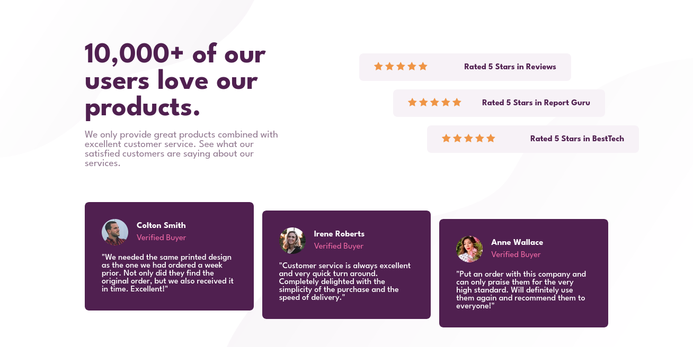
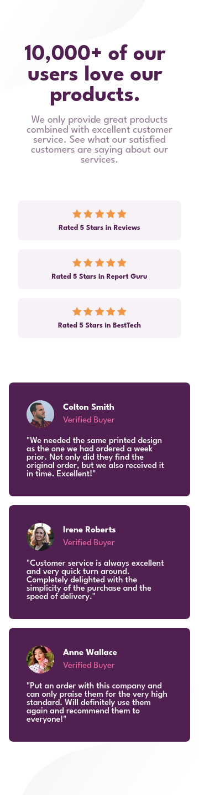

# Social Proof Section

This is a solution to the **Social Proof Section challenge** from [Frontend Mentor](https://frontendmentor.io).- [Social Proof Section](#social-proof-section)

- [Social Proof Section](#social-proof-section)
  - [Time taken](#time-taken)
  - [Preview 🖼](#preview-)
    - [Desktop 💻](#desktop-)
    - [Mobile 📱](#mobile-)
  - [Tools and Techniques](#tools-and-techniques)
  - [Links 🔗](#links-)

## Time taken

**Took about 3 hours to complete.**

## Preview 🖼

A sneak peek at what I built and how it looks on different devices.

### Desktop 💻

Preview of the website on a laptop or desktop screen.

### Mobile 📱

Preview of the website on a laptop or desktop screen.

## Tools and Techniques

Tools, languages and different techniques used in this project.

- [Visual Studio Code](https://code.visualstudio.com)
- [Firefox Nightly Edition](https://www.mozilla.org/en-US/firefox/channel/desktop/)
- CSS - `grid` and `flex`
- Locally hosted fonts

## Links 🔗

Links for deployment live preview and github repository.

- GitHub: [Code-Beaker/social-proof-section](https://github.com/Code-Beaker/social-proof-section)
- GitHub Pages deploy: [code-beaker.github.io/social-proof-section](https://code-beaker.github.io/social-proof-section/)
